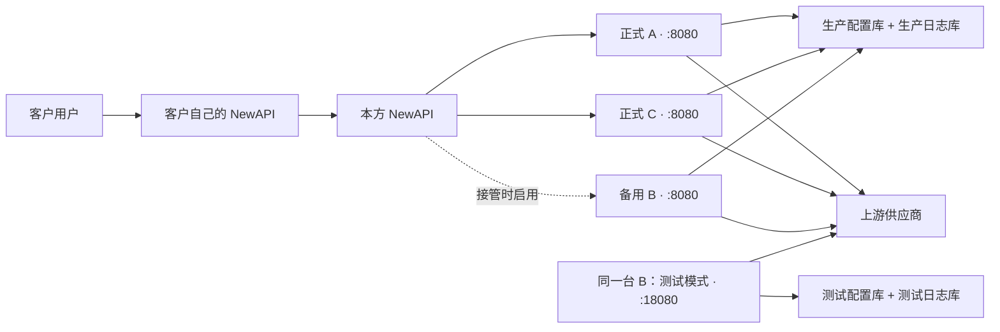
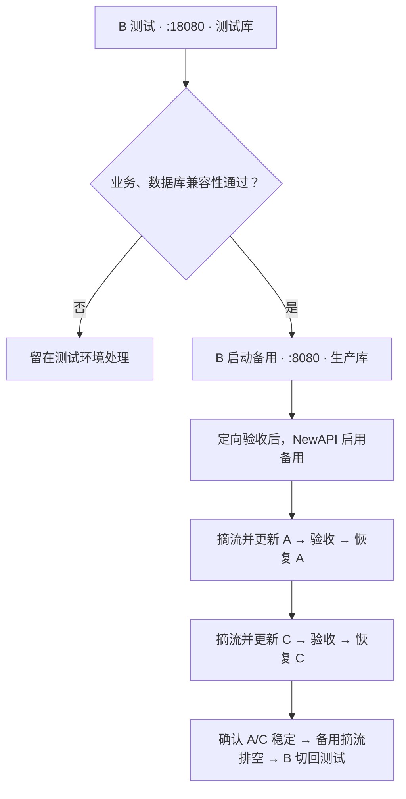

# Bifrost 多节点部署与发布手册

> 适用架构：NewAPI → 两台正式 Bifrost → 共享 PostgreSQL，另有一台测试/备用 Bifrost。
> 已确认状态：2026-09-04，三台 Bifrost 均已接管到统一目录并完成实际请求验收，运行版本为 `2.0.0-moon.18`。下文 `.19` 仅为发布示例。

本文负责**架构、发布顺序、备份、回退和验收**；具体操作统一看 [bifrost-deploy 操作手册](deployment/BIFROST-DEPLOY.md)，增加服务器看 [新服务器部署](deployment/NEW-NODE.md)。

- [1. 服务器与架构](#inventory)
- [2. 统一目录与首次接管](#install)
- [3. 构建与版本配套](#artifacts)
- [4. 发布前准备](#preflight)
- [5. 正式发布顺序](#release)
- [6. 失败回退](#rollback)
- [7. 数据库与 Langfuse](#dependencies)
- [8. 验收与日常维护](#operations)

<a id="inventory"></a>

## 1. 服务器与架构

| 角色 | 公网 IP | 内网 IP | 配置基线 | 用途 |
|---|---|---|---|---|
| 正式 A | `159.75.78.126` | `10.1.4.5` | 4 核 / 8GB / 原 120GB | 正式流量 |
| 正式 C | `134.175.41.186` | `10.1.12.10` | 4 核 / 8GB，磁盘容量待核对 | 正式流量；Tailscale 名称 `bifrost-186` |
| 测试/备用 B | `175.178.193.178` | `10.1.12.17` | 4 核 / 8GB / 原 120GB | 平时测试，发布或故障时临时接管生产 |
| 数据库 D | `134.175.134.225` | `10.1.12.7` | 2 核 / 8GB / 约 500GB | PostgreSQL 16 |
| 本方 NewAPI | 待补入台账 | 待补入台账 | 原 2 核 / 4GB / 60GB | 对外入口；应用及 PostgreSQL 15 仍在原机 |

Bifrost、NewAPI 和 PostgreSQL 之间的服务通信继续使用内网 IP。公网 IP 仅用于受控运维入口，不写入 Bifrost 数据库连接配置，也不据此向公网开放 PostgreSQL 5432。



B 的测试和备用模式**二选一，不同时运行**。P、Q 在同一台数据库服务器上，数据库和账号分开：

| 环境 | 配置库 | 日志库 | 账号 |
|---|---|---|---|
| 正式 A/C、备用 B | `bifrost_prod_config` | `bifrost_prod_logs` | `bf_prod` |
| 测试 B | `bifrost_test_config` | `bifrost_test_logs` | `bf_test` |

NewAPI 按渠道优先级、权重分发初始请求；**当前没有配置失败后的渠道重试/切换**，供应商 fallback 由 Bifrost 处理。客户不能直连 Bifrost，也不应从响应中看到 Bifrost 或供应商身份。

<a id="install"></a>
<a id="daily"></a>

## 2. 统一目录与部署入口

三台 Bifrost 当前都使用 `/opt/bifrost/`：

| 内容 | 统一位置 / 管理方式 |
|---|---|
| 操作入口 | `/opt/bifrost/bifrost-deploy` |
| 目标版本 | `versions.env`：测试、备用、正式分别设置 |
| 当前部署 | `compose.yaml`，由脚本生成，不手工修改 |
| 配置、凭据 | `config/`、`secrets/`；密码文件权限 600 |
| 发布包、运行数据 | `releases/<版本>/`、`data/<模式>/` |
| 部署快照 | `backups/`，**不是 PostgreSQL 备份** |

后台仍统一管理 Provider、Key、路由、fallback 和插件业务配置。不要向本地数据库连接配置重新加入旧的业务配置块，以免启动时覆盖后台设置。

现有三台已经统一，不再从原目录启动服务，也不重复执行旧迁移命令。日常发布使用 `import → plan → deploy → verify`。全新服务器从标准目录开始，使用 `bootstrap → import → plan → launch`，不创建旧 Compose 或 SQLite 布局。

工具需要 Python 3.11+、Docker/Compose 和 PostgreSQL 客户端。增加节点前还要配置数据库来源权限、安全组和 Tailscale；完整步骤见 [新服务器部署](deployment/NEW-NODE.md)。

<a id="artifacts"></a>
<a id="plugin"></a>

## 3. 构建与版本配套

在构建机保持 `bifrost/` 与 `bifrost-moon-plugin/` 两个仓库相邻，确认源码改动并记录各自 commit。下面在 Bifrost 仓库根目录执行：

```bash
RELEASE_VERSION=2.0.0-moon.19

docker build --platform linux/amd64 \
  --build-arg VERSION="$RELEASE_VERSION" \
  -f transports/Dockerfile.dynamic-debian \
  -t "bifrost-moon:$RELEASE_VERSION" .

(
  cd ../bifrost-moon-plugin
  scripts/build-fork-plugin.sh "$RELEASE_VERSION"
)
```

两项构建都成功、相应测试通过后，按 [打包与导入步骤](deployment/BIFROST-DEPLOY.md) 执行 `pack`，将同一发布包导入各节点。导入不会重启服务；正式更新时才选择对应环境的版本。

配套规则：

- 镜像与插件使用同一发布号、Go 1.27.0、Linux AMD64、Debian/glibc，以及一致的共享包构建输入；构建期间不要修改源码。
- 不用同一 tag 或插件文件名覆盖发布不同二进制；保留旧镜像、插件与校验清单供回退。
- 宿主机 Go 命令使用 `scripts/with-moon-v2-cache.sh`，不另建仓库内缓存。
- `pack` 生成校验清单，`import` 校验上传产物；两者不能证明插件 ABI 或业务兼容，必须在测试环境验证。

共享数据库中的 Moon 插件入口保持不变：

```text
/app/data/plugins/bifrost-moon-response-sanitizer-linux-amd64-glibc-2.0.0-moon.18.so
```

`bifrost-deploy` 将本节点 `releases/<版本>/moon.so` 挂载到这个固定入口。**实际版本看镜像、挂载来源和 SHA，不看入口文件名；不要为了升级一台而修改共享插件路径。**

更多 fork 构建背景见 [MAINTENANCE.md](MAINTENANCE.md) 和插件仓库的 [RELEASE.md](https://github.com/northmoon-labs/bifrost-moon-plugin/blob/main/docs/RELEASE.md)。其中旧 SQLite/Canary 启动命令不用于当前共享库部署。

<a id="preflight"></a>
<a id="rules"></a>

## 4. 发布前准备

### 4.1 先确认数据库兼容

候选版本**第一次以备用模式启动，就可能迁移生产数据库**，不必等 NewAPI 启用渠道。

| 数据库变更情况 | 发布方式 |
|---|---|
| 无变化，旧/新程序及配置兼容 | 完成测试后正常滚动发布 |
| 有迁移，已验证旧/新共存及向后回退 | 评估 DDL 锁和耗时后滚动发布 |
| 旧版本不兼容，或兼容性未确认 | 暂停滚动发布，另定维护窗口与恢复方案 |

有迁移时，在隔离测试库验证：**旧版 → 新版 → 旧版读取/写入迁移后的库 → 新版**。不能通过先清空测试库来“验证回退”。大日志表 DDL 还要用有代表性的数据规模验证锁与耗时。

### 4.2 备份与恢复点

每次发布前确认三类备份：**Bifrost 数据库、NewAPI 数据库、节点部署文件与旧发布包**。

`bifrost-deploy` 自动保存节点部署快照；数据库恢复点仍需单独准备。已有经过恢复验证的物理备份/PITR/快照方案时，按现行方案执行，不必每次再全量 dump 大日志库。

<details>
<summary>需要逻辑备份时：数据库 D 上的 Bifrost 备份命令</summary>

只在 `10.1.12.7` 执行；先确认空间和低峰窗口。任一步失败都停止，不继续上线：

```bash
(
  set -e
  sudo install -d -m 700 -o postgres -g postgres /var/lib/postgresql/bifrost-backups
  BF_DB_BACKUP=$(sudo -u postgres mktemp -d /var/lib/postgresql/bifrost-backups/pre-release.XXXXXX)
  sudo -u postgres pg_dump -Fc --lock-wait-timeout=5s -d bifrost_prod_config \
    -f "$BF_DB_BACKUP/prod-config.dump"
  sudo -u postgres pg_dump -Fc --lock-wait-timeout=5s -d bifrost_prod_logs \
    -f "$BF_DB_BACKUP/prod-logs.dump"
  sudo -u postgres pg_restore --list "$BF_DB_BACKUP/prod-config.dump" >/dev/null
  sudo -u postgres pg_restore --list "$BF_DB_BACKUP/prod-logs.dump" >/dev/null
  printf '数据库备份：%s\n' "$BF_DB_BACKUP"
)
```

</details>

<details>
<summary>NewAPI 原机的数据库备份命令</summary>

先确认数据库容器仍为 `postgres`、数据库 `new-api`、账号 `root`。这不是数据库 D 上的命令：

```bash
(
  set -e
  sudo install -d -m 700 -o ubuntu -g ubuntu /opt/newapi-backups
  umask 077
  BF_NEWAPI_BACKUP=$(mktemp /opt/newapi-backups/new-api.XXXXXX)
  sudo docker exec postgres pg_dump -U root -d new-api -Fc > "$BF_NEWAPI_BACKUP"
  test -s "$BF_NEWAPI_BACKUP"
  sudo docker exec -i postgres pg_restore --list < "$BF_NEWAPI_BACKUP" >/dev/null
  printf 'NewAPI 备份：%s\n' "$BF_NEWAPI_BACKUP"
)
```

</details>

`pg_restore --list` 只检查归档目录可读，不代表恢复演练通过；备份应异机保存并验证可恢复。分别备份的数据库不是跨库原子快照，涉及计费/任务一致性的恢复需单独对账。测试库若有需要保留的改动，升级前也应备份。

### 4.3 摘流和排空

先在 NewAPI 停用目标节点渠道，并停止直连请求，再等待在途生图结束。仅 CPU 空闲、容器 healthy 或等待固定秒数，都不能证明请求排空。

可辅助观察目标节点的 `/metrics` 中 `bifrost_active_requests`：相关项持续为 0，并结合请求完成记录判断；指标缺失、401 或抓取失败不能当作 0。它不覆盖全部上传、异步任务和日志缓冲；未来接入异步视频后还要处理任务交接。

<a id="release"></a>

## 5. 正式发布顺序



具体命令见 [bifrost-deploy 日常更新](deployment/BIFROST-DEPLOY.md)，这里只保留发布中的人工决策：

1. **测试：** B 只修改 `TEST_VERSION`，使用测试库。验证实际生图、图片编辑、fallback、日志和信息隐藏；有数据库变化还要完成第 4 节兼容性测试。
2. **备用：** 测试通过、生产恢复点就绪后，将 `STANDBY_VERSION` 改为同一已批准版本并启动。先定向请求验收，再启用 NewAPI 的 B 渠道。
3. **接管：** B 渠道使用 `10.1.12.17:8080`，不能指向测试端口 18080；渠道 URL 是否带 `/v1` 沿用已验证格式。先低权重观察，确认实际承接能力。
4. **正式：** A、C 的 `PRODUCTION_VERSION` 使用已验证发布包。一次摘除一台，排空后更新，验收恢复，再处理下一台；A 失败就不继续摘 C。
5. **收尾：** A/C 流量稳定后停用 B 的备用渠道、排空，再切回测试模式。备用版本保留已批准版本，下一轮测试只改测试版本。

NewAPI 切流由管理员执行，脚本不会自动调整渠道。单台 B 不等于两台正式的总容量；只有实测能承接低峰总量，才考虑同时停用 A/C。

<a id="rollback"></a>

## 6. 失败回退

失败节点保持摘流，先让其他已验证节点承接，不继续升级下一台。

| 情况 | 处理 |
|---|---|
| 仅测试失败 | 在测试环境处理，不切生产渠道 |
| 节点更新失败，数据库仍向后兼容 | 使用 `bifrost-deploy rollback` 恢复最近一次部署转换；步骤见 [操作手册](deployment/BIFROST-DEPLOY.md) |
| 新数据库结构不兼容旧程序 | 不直接换旧镜像；进入受控维护、数据库修复/恢复方案 |

`rollback` 恢复的是上一套容器部署：镜像、插件、部署配置及模式，**不回退数据库或业务数据**。首次接管可恢复保留的旧容器；它不是任意历史版本选择器，也不会自动修改 `versions.env`。回退验收后再恢复渠道，下次发布前检查目标版本。

若存在 `pending.json`，先查看状态并处理未完成操作，不删除它绕过保护。

数据库级恢复会影响所有共享库节点，可能丢失恢复点之后的数据。必须批准停写窗口及数据损失范围，停止相关写入者，优先在隔离库验证恢复并完成业务对账；**不能在其他节点仍写生产库时覆盖恢复**。旧 SQLite 容器不是共享库部署的日常版本回退方式。

<a id="dependencies"></a>

## 7. 数据库与 Langfuse

### PostgreSQL

D 使用原生 PostgreSQL 16，实例 `16/main`，数据目录 `/var/lib/postgresql/16/main`，监听本机及 `10.1.12.7` 的 5432 端口。

已设置基线：`shared_buffers=2GB`、`effective_cache_size=5GB`、`work_mem=4MB`、`maintenance_work_mem=256MB`、`max_connections=100`、SCRAM 密码认证。缓存估计不等于额外内存分配，这些参数也不是上线容量保证。

应用使用 `sslmode=require`，要求加密但不等于 `verify-full` 身份校验。数据库安全组和 HBA 仅允许已批准的 Bifrost 来源及对应账号，不开放公网全部来源。应用机只需客户端；`sudo -u postgres` 管理命令在 D 上执行。

需要从本地电脑访问数据库时，可通过数据库 D 的公网地址 `134.175.134.225` 建立 SSH 本地端口转发，再连接隧道端口；不要把 PostgreSQL 5432 直接开放到公网。

需要确认某节点实际连接环境时，在 D 查询 `pg_stat_activity` 的 `client_addr`、`datname`、`usename`，不要只相信节点标签。

### Langfuse / Tailscale

生产 A/C 与备用 B 保留可用 Tailscale 路由，以及容器域名映射：

```yaml
extra_hosts:
  - "langfuse-archive.tailb34b09.ts.net=100.108.96.112"
```

| 用途 | 已确认地址 |
|---|---|
| OTLP Trace | `https://langfuse-archive.tailb34b09.ts.net:10443/api/public/otel/v1/traces` |
| 私有媒体上传 Origin | `https://langfuse-archive.tailb34b09.ts.net:10444` |

在对应 OTel/Langfuse profile 的 `media_upload_allowed_origins` 填精确 HTTPS Origin，不含路径或签名参数。图片用 10444，不意味着 OTLP 也要改为 10444。

域名解析、Tailscale 路由、端口/TLS、认证和媒体允许列表是不同检查；最终以 Trace **及图片**落地为准，不通过关闭 SSRF 或 TLS 校验解决问题。

<a id="test-data"></a>

### 测试数据与共享配置

B 测试模式连接独立测试库，当前关闭 OTel、告警、日报等已知外部集成，但供应商配置仍可能调用真实接口并计费。测试这些集成时先配置测试专用目的地。

日常发版保留测试数据，不自动清库。需要重新克隆配置时，使用经过当前 schema 审阅的 [seed-test-config.py](deployment/tools/seed-test-config.py)：现有工具针对本次 `.18` 布局，要求两个测试库为空且无连接；表数量检查不等于完整 schema 验证。重建测试库须另行批准并备份，不能将测试库整体覆盖生产。

共享配置不保证所有节点立即刷新内存。后台修改后，要验证实际处理请求的节点；必要时逐台摘流重建。

<a id="operations"></a>

## 8. 验收与日常维护

`healthy`、`VERIFY_OK` 只是基础检查通过。恢复渠道前至少完成：

| 验收项 | 通过条件 |
|---|---|
| 环境与配套 | 模式、端口、数据库正确；镜像/插件匹配，Moon 可用 |
| 生图与编辑 | 真实业务模型、尺寸、URL/base64、多图组合按支持范围验证 |
| fallback | 测试中验证失败后确实切换到预期供应商 |
| 日志与结果 | 图片可查看；正式节点能查到同一请求记录；测试日志留在测试库 |
| 身份隐藏 | 正常/错误响应、响应头和图片 URL 不泄漏禁止暴露的信息 |
| Langfuse | 正式/备用的新请求 Trace 与媒体均可查看 |
| NewAPI 与负载 | 定向请求及实际分流正常；请求期间资源、延迟和错误率可接受 |

日常状态、版本和基础验证使用 `bifrost-deploy status` / `bifrost-deploy verify`。保存的 Moon 启动证据不是插件热更新后的持续监控，后台改插件后仍需业务验收。

清理单独安排，不混入升级：

- 旧目录、旧 SQLite、旧镜像和发布包先保留；三台当前都已接管，但旧目录仍可能用于回退。确认所有引用及备份后再清理。
- A 已取消的历史日志迁移不自动续跑；B 的 2026-09-03 旧主日志及关联观测记录已收到完成标志。
- 不使用全局 Docker prune 或批量删除恢复空间；明确精确目标和保留周期。
- 两台 Bifrost 加备用不是全链路高可用：共享 PostgreSQL、单机 NewAPI 仍有单点风险。

<a id="record"></a>

### 发布记录

每次至少记录：发布/回退版本、两个仓库 commit、产物校验值、数据库兼容结论与恢复点、各节点实际模式/版本、验收请求 ID、NewAPI 摘流和恢复时间，以及未完成项。台账不记录密码、Key 或签名 URL。

正常收尾状态：**A/C 正式运行；B 为 test:18080；B 的生产备用渠道禁用。**
