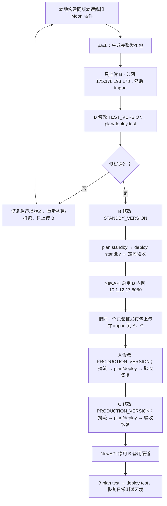

<!-- generated-by: gsd-doc-writer -->
# bifrost-deploy：统一部署操作手册

三台现有 Bifrost 已统一使用 `/opt/bifrost/`。日常发布使用 `bifrost-deploy`，不再编辑各机器原来的 Compose 文件。

| 角色 | SSH / SFTP 运维公网 IP | 服务内网 IP |
|---|---|---|
| A 生产 | `159.75.78.126` | `10.1.4.5:8080` |
| C 生产 | `134.175.41.186` | `10.1.12.10:8080` |
| B 测试/备用 | `175.178.193.178` | 测试 `10.1.12.17:18080`；备用 `10.1.12.17:8080` |
| D 数据库运维 | `134.175.134.225` | PostgreSQL `10.1.12.7:5432` |

完整架构、数据库备份和发布门槛见 [部署手册](../DEPLOYMENT.md)。全新服务器见 [新服务器部署](NEW-NODE.md)。
当前基线为 `2.0.0-moon.18`。人工登录和上传使用公网 IP；NewAPI 渠道、Bifrost 数据库连接以及服务器间通信使用内网 IP。不要把公网地址填入服务配置，数据库 5432 不开放公网。

## 一页看懂完整更新流程



每个动作的含义：

| 动作 | 结果 |
|---|---|
| `pack` | 将同版本镜像和插件组成 `image.tar + moon.so + release.json` |
| 上传 | 把同一个发布目录复制到目标服务器 `inbox/` |
| `import` | 校验并登记发布包、加载镜像，但不重启服务 |
| 修改 `versions.env` | 选择该角色下一次部署的版本，但不立即切换 |
| `plan` | 在不停止服务的情况下预检目标版本、插件、数据库和端口 |
| `deploy` | 经人工确认后真正重建容器并切换配套镜像和插件 |
| 业务验收 | 用真实请求验证结果、fallback、共享日志、身份隐藏和 Langfuse |

推荐只先分发到 B。B 测试通过、切换生产备用并加入 NewAPI 后，才把**完全相同且校验值不变**的发布包分发到 A、C。真正影响运行服务的是 `deploy`；生产节点必须先在 NewAPI 摘流并排空，再执行它。

## 1. 命令与目录

以后统一执行：

```bash
sudo /opt/bifrost/bifrost-deploy status
```

| 命令 | 用途 | 是否改变运行服务 |
|---|---|---|
| `status` | 查看实际角色、版本、端口和待处理操作 | 否 |
| `import` | 校验并登记镜像和插件发布包 | 否 |
| `plan <角色>` | 校验目标版本、数据库、插件和端口配置 | 否 |
| `deploy <角色>` | 重建现有受管节点，或在 B 切换测试/备用 | 是 |
| `verify` | 复核当前容器、挂载、数据库和启动证据 | 否 |
| `rollback` | 回到最近一次部署转换 | 是 |

`bootstrap / launch` 只用于全新服务器；`init / adopt` 只保留给旧部署恢复，不在现有三台重复执行。

```text
/opt/bifrost/
├── bifrost-deploy         # 主操作入口
├── versions.env           # 各角色的目标版本
├── compose.yaml           # 自动生成，不手改
├── config/                # 节点和角色配置
├── secrets/               # 数据库密码，权限 600
├── releases/<版本>/       # 配套镜像归档、Moon 插件和清单
├── plugins/               # 固定插件入口的父目录
├── data/<角色>/           # 各角色独立运行数据
├── inbox/                 # 待导入发布包
└── backups/               # 部署快照，不是数据库备份
```

`state.json`、`pending.json` 和 `backups/` 由工具管理。不要手改或删除来绕过检查。

## 2. 现有服务器切换到新名称

将仓库中的 `scripts/deployment/bifrost-deploy` 上传到服务器，例如 `/home/ubuntu/bifrost-deploy`，然后：

```bash
sudo install -o root -g root -m 755 \
  /home/ubuntu/bifrost-deploy \
  /opt/bifrost/bifrost-deploy

sudo /opt/bifrost/bifrost-deploy status
sudo /opt/bifrost/bifrost-deploy verify
```

这只更换工具文件，不重建容器。新工具兼容现有容器的旧 `bfctl` 管理标签。

如需保留旧命令兼容入口，再将仓库中的 `scripts/deployment/bfctl` 安装为 `/opt/bifrost/bfctl`。旧入口只负责转到 `bifrost-deploy`。确认三台新入口都正常前，不删除服务器上原来的工具。

## 3. 标准更新七步

以下 `.19` 只是示例，实际使用本次批准的版本。

### 第一步：本地构建镜像和插件

```bash
RELEASE_VERSION=2.0.0-moon.19

docker build --platform linux/amd64 \
  --build-arg VERSION="$RELEASE_VERSION" \
  -f transports/Dockerfile.dynamic-debian \
  -t "bifrost-moon:$RELEASE_VERSION" .

(
  cd ../bifrost-moon-plugin
  scripts/build-fork-plugin.sh "$RELEASE_VERSION"
)
```

镜像和插件必须来自同一发布号及同一套源码构建输入。完整约束见 [构建流程](../DEPLOYMENT.md#artifacts)。

### 第二步：打成一个发布包

```bash
python3 scripts/deployment/bifrost-deploy pack \
  2.0.0-moon.19 \
  --plugin ../bifrost-moon-plugin/build/bifrost-moon-response-sanitizer-linux-amd64-glibc-2.0.0-moon.19.so \
  --output ./release-packages/bifrost-release-2.0.0-moon.19
```

输出目录固定包含：

```text
release-packages/bifrost-release-2.0.0-moon.19/
├── image.tar
├── moon.so
└── release.json
```

`release-packages/` 位于当前 Bifrost 项目根目录并已加入 `.gitignore`。每个版本使用独立目录；`pack` 会拒绝覆盖已经存在的同名发布目录。

### 第三步：上传到服务器

此时**只上传到测试/备用服务器 B**，SSH/SFTP 目标为公网 `175.178.193.178`。上传后的服务器路径为：

```text
/opt/bifrost/inbox/bifrost-release-2.0.0-moon.19/
```

第一次上传前，只把专用 `inbox/` 目录交给 `ubuntu` 用户；不要修改整个 `/opt/bifrost`：

```bash
sudo install -d -o ubuntu -g ubuntu -m 700 /opt/bifrost/inbox
test -w /opt/bifrost/inbox && echo "inbox 可以上传"
```

上传不会改变当前运行版本。`inbox/` 只用于发布包，不放数据库密码。

### 第四步：在 B 导入并部署测试环境

先在 B 导入：

```bash
sudo /opt/bifrost/bifrost-deploy import \
  /opt/bifrost/inbox/bifrost-release-2.0.0-moon.19
```

`import` 校验镜像和插件、加载镜像并登记配套版本，但不会重启服务。然后只修改 B 的测试版本，备用继续保持已批准的生产版本：

```dotenv
TEST_VERSION=2.0.0-moon.19
STANDBY_VERSION=2.0.0-moon.18
```

```bash
sudo nano /opt/bifrost/versions.env
sudo /opt/bifrost/bifrost-deploy plan test
sudo /opt/bifrost/bifrost-deploy deploy test
```

测试使用 18080 和测试数据库，不加入 NewAPI 生产渠道。完成真实生图、编辑、fallback、日志和身份隐藏验收。

如果测试失败：

1. 不向 A、C 上传这个未通过的发布包。
2. 修复源码后使用新的版本号，例如 `.19` 失败后改为 `.20`。
3. 重新构建、`pack`，并只向 B 上传、导入和测试新版本。

不要覆盖或重新发布同一个版本号；`import` 会拒绝同版本不同内容。

### 第五步：B 启动同版本生产备用

测试通过，并确认生产数据库备份及新旧 schema 共存/回退兼容性后，将 B 的备用版本改为 `.19`：

```dotenv
TEST_VERSION=2.0.0-moon.19
STANDBY_VERSION=2.0.0-moon.19
```

```bash
sudo nano /opt/bifrost/versions.env
sudo /opt/bifrost/bifrost-deploy plan standby
sudo /opt/bifrost/bifrost-deploy deploy standby
```

备用使用 8080 和生产数据库。先定向验收，再由管理员在 NewAPI 启用 B 的内网渠道 `10.1.12.17:8080`。

### 第六步：备用正常后，再上传 A、C

B 已通过生产库定向验收并加入 NewAPI 后，将 B 上验证过的**同一个发布目录**上传到：

- A：公网 `159.75.78.126`
- C：公网 `134.175.41.186`

两台上传后的服务器路径均为：

```text
/opt/bifrost/inbox/bifrost-release-2.0.0-moon.19/
```

A、C 第一次上传前也分别执行一次：

```bash
sudo install -d -o ubuntu -g ubuntu -m 700 /opt/bifrost/inbox
test -w /opt/bifrost/inbox && echo "inbox 可以上传"
```

在 A、C 分别执行：

```bash
sudo /opt/bifrost/bifrost-deploy import \
  /opt/bifrost/inbox/bifrost-release-2.0.0-moon.19
```

三台的 `release.json`、镜像归档和 `moon.so` 必须来自同一个已验证发布包，不在测试通过后重新打包。

### 第七步：依次更新 A、C，最后让 B 返回测试

人工登录 A 使用公网 `159.75.78.126`，登录 C 使用公网 `134.175.41.186`；NewAPI 中摘流的仍是对应内网渠道 `10.1.4.5:8080`、`10.1.12.10:8080`。A、C 各自修改：

```dotenv
PRODUCTION_VERSION=2.0.0-moon.19
```

先在 NewAPI 摘除目标节点并排空，再在该节点执行：

```bash
sudo nano /opt/bifrost/versions.env
sudo /opt/bifrost/bifrost-deploy plan production
sudo /opt/bifrost/bifrost-deploy deploy production
```

A 实际请求验收并恢复渠道后，再以相同步骤处理 C；A 失败时不继续摘 C。

A/C 稳定后，在 NewAPI 停用 B 备用渠道并排空，然后让 B 返回测试：

```bash
sudo /opt/bifrost/bifrost-deploy plan test
sudo /opt/bifrost/bifrost-deploy deploy test
```

正常收尾状态：A/C 生产，B 为 test:18080，B 的生产备用渠道关闭。

## 4. 工具检查与业务验收

`deploy` 自动保存部署快照，并核对镜像、插件和配置哈希、数据库身份/TLS、健康状态及 Moon 启动证据。

```bash
sudo /opt/bifrost/bifrost-deploy status
sudo /opt/bifrost/bifrost-deploy verify
```

`VERIFY_OK` 后仍需手动验证真实生图、图片编辑、fallback、图片与共享日志、身份隐藏、Langfuse Trace/媒体，以及 NewAPI 实际分流和资源。工具不自动发起付费推理，不切 NewAPI 渠道，不备份或恢复 PostgreSQL。

共享配置库中的 Moon 路径保持固定；本机通过 `releases/<版本>/moon.so` 覆盖该入口。不要为了升级单台服务器修改共享插件路径。

## 5. 失败与回退

失败节点保持摘流，先查看：

```bash
sudo /opt/bifrost/bifrost-deploy status
sudo /opt/bifrost/bifrost-deploy rollback
```

`rollback` 只恢复最近一次容器部署转换，包括镜像、插件、配置和模式；它不恢复 PostgreSQL、业务数据或任意历史版本，也不会修改 `versions.env`。

若新 schema 不兼容旧程序，不要靠换回旧镜像冒险。存在 `pending.json` 时不要删除它，应先按状态处理回退。旧目录、旧容器和部署快照在回退窗口结束前继续保留。
